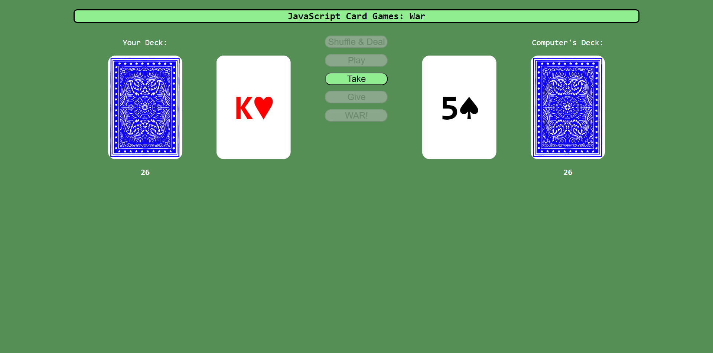

# JavaScript Card Game: War

## Description

After being able to generate cards more dynamically, I wanted to be able to re-create a very easy card game like War in order to demonstrate the ability to assign values to cards, deal cards out to players properly, and resolve game logic properly based on the rules of the game.

## Installation

You can access this page with the following URL: https://jmcmillenmusic.github.io/js-card-game-war/

## Usage

Click on the Shuffle button first to shuffle the deck. Then, click on the Play button to play your top card and the computer's top card. If you win, click on the Take button to take its card. If you lose, click on the Give button to give up your card. If there's a tie, click on the War button so that you and the computer will play 4 additional cards each with only the last one being shown, then click on either Take, Give, or War after that. Once you or the computer wins, you'll get an indicator displayed declaring the winner.

## Credits

N/A

## License

This project uses the MIT License.